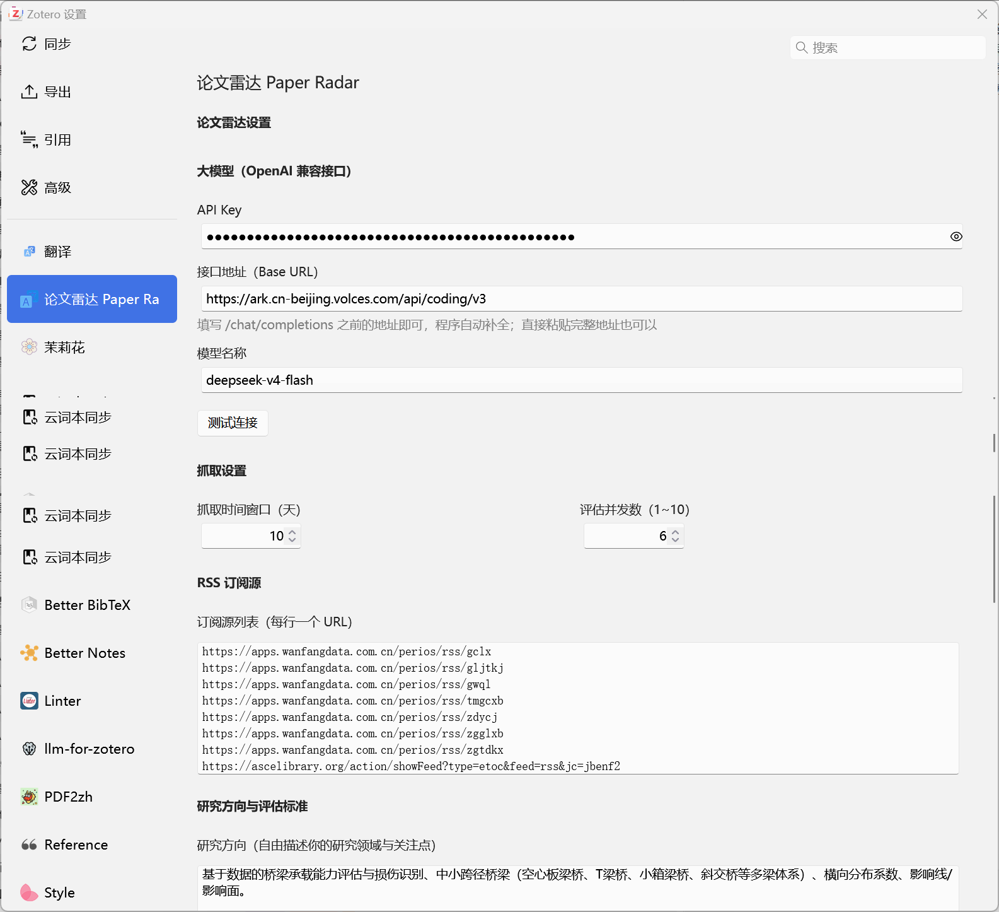

# Paper Radar（论文雷达）

> Zotero 插件：自动盯梢期刊更新，AI 帮你筛论文，高相关的直接进文献库。支持 Zotero 7 / 8 / 9。



## 这是什么

Paper Radar 把"每周手动翻期刊找论文"变成一条全自动流水线：

1. **抓取**：并发监控你订阅的期刊 RSS（默认内置 14 个土木/桥梁期刊，覆盖万方、ASCE、Elsevier、Taylor & Francis，可自由增删）；
2. **评估**：逐篇调用大模型，按你的研究方向研判相关度（高/中/低），并生成 2 句中文解读；
3. **入库**：高、中相关论文自动存入 Zotero 专属分类，带完整元数据（Crossref 补全 DOI、期刊、卷期、页码）、`相关度：高/中` 标签，以及一条**「AI 研判解读」子笔记**；
4. **去重**：低相关论文本地记录跳过，不占文献库；已处理的论文永不重复评估、重复入库。

```
期刊 RSS ──▶ 时间过滤 + 去重 ──▶ 大模型评估 ──▶ 高/中相关入库（标签 + AI 笔记）
                                              └─▶ Zotero 账号同步自动上传云端
```

**主要特性**：

- 🔌 任意 OpenAI 兼容接口：火山方舟 / DeepSeek / 硅基流动 / 本地 Ollama 均可
- ✍️ 研究方向自由填写，评估提示词可一键「AI 生成」

## 安装

1. 从 [Releases](https://github.com/xiaoxuan353/zotero-paper-radar/releases) 下载最新的 `paper-radar.xpi`；
2. Zotero 菜单 `工具 → 插件`，点右上角齿轮，选 **Install Plugin From File…**，选中下载的 xpi；
3. 按提示重启 Zotero 即可。

<details>
<summary>从源码构建（开发者）</summary>

```bash
git clone https://github.com/xiaoxuan353/zotero-paper-radar.git
cd zotero-paper-radar
npm install
npm run build
# 产物位于 .scaffold/build/paper-radar.xpi
# 开发调试：复制 .env.example 为 .env 并填入 Zotero 路径后 npm start（热重载）
```
</details>

## 使用

### 首次配置（约 2 分钟）

打开 Zotero 设置，左侧最下方找到 **「论文雷达 Paper Radar」** 面板（见上方截图）：

1. **大模型（OpenAI 兼容接口）**：填写 API Key、接口地址和模型名，点 **「测试连接」**，看到 ✅ 即通。接口地址填 `/chat/completions` 之前的 Base URL 即可，程序自动补全：
   | 平台 | 接口地址（Base URL） | 模型示例 |
   |---|---|---|
   | 火山方舟 Coding Plan | `https://ark.cn-beijing.volces.com/api/coding/v3` | `deepseek-v4-flash` |
   | 火山方舟 按量付费 | `https://ark.cn-beijing.volces.com/api/v3` | 接入点 `ep-…` |
   | DeepSeek 官方 | `https://api.deepseek.com/v1` | `deepseek-chat` |
   | 本地 Ollama | `http://localhost:11434/v1` | `qwen3:8b` 等 |
2. **研究方向**：自由描述你的研究领域与关注点（出厂默认为桥梁承载能力评估方向，换成你自己的）；
3. 点 **「AI 生成评估要求」**：调用你的大模型，自动生成与研究方向匹配的高/中/低分档判定标准（也可手工修改，但第 1 条输出格式规则为程序解析所需，勿动）；
4. **RSS 订阅源**：每行一个 URL，按需增删。默认内置 14 个订阅源：

   | 期刊 | 订阅 URL |
   |---|---|
   | 工程力学（万方） | `https://apps.wanfangdata.com.cn/perios/rss/gclx` |
   | 公路交通科技（万方） | `https://apps.wanfangdata.com.cn/perios/rss/gljtkj` |
   | 国外桥梁（万方） | `https://apps.wanfangdata.com.cn/perios/rss/gwql` |
   | 土木工程学报（万方） | `https://apps.wanfangdata.com.cn/perios/rss/tmgcxb` |
   | 振动与冲击（万方） | `https://apps.wanfangdata.com.cn/perios/rss/zdycj` |
   | 中国公路学报（万方） | `https://apps.wanfangdata.com.cn/perios/rss/zgglxb` |
   | 中国铁道科学（万方） | `https://apps.wanfangdata.com.cn/perios/rss/zgtdkx` |
   | J. Bridge Engineering（ASCE） | `https://ascelibrary.org/action/showFeed?type=etoc&feed=rss&jc=jbenf2` |
   | J. Structural Engineering（ASCE） | `https://ascelibrary.org/action/showFeed?type=etoc&feed=rss&jc=jsendh` |
   | Engineering Structures（Elsevier） | `https://rss.sciencedirect.com/publication/science/01410296` |
   | Structures（Elsevier） | `https://rss.sciencedirect.com/publication/science/23520124` |
   | Thin-Walled Structures（Elsevier） | `https://rss.sciencedirect.com/publication/science/02638231` |
   | J. Sound and Vibration（Elsevier） | `https://rss.sciencedirect.com/publication/science/0022460X` |
   | Structure and Infrastructure Engineering（T&F） | `https://www.tandfonline.com/feed/rss/nsie20` |

   新增其他期刊：万方期刊主页的 RSS 链接替换期刊代码即可；Elsevier 把期刊 ISSN 去掉横线拼入 `https://rss.sciencedirect.com/publication/science/<ISSN>`；ASCE / T&F 在期刊页面找 RSS 图标复制链接。

## 常见问题

**Q: 分享插件会泄露我的 API Key 吗？**
不会。Key 只存于你本机 Zotero 配置目录，插件文件（xpi）与仓库源码中均不含密钥。

**Q: 为什么不需要 Zotero 的 User ID / API Key？**
插件运行在 Zotero 内部，直接调用程序接口写本地文献库；上传云端由 Zotero 自带的账号同步完成，与手动添加文献的路径完全一致。

**Q: 中文期刊支持如何？**
万方源正常抓取评估；Crossref 元数据补全对中文期刊有限，标题、摘要、链接正常入库。

**Q: 可以离线用吗？**
入库可以（本地写库），抓取与评估需要网络。

## 开发

基于 [zotero-plugin-template](https://github.com/windingwind/zotero-plugin-template) 构建（TypeScript + esbuild + zotero-plugin-scaffold）。

## 许可

AGPL-3.0-or-later（继承自 zotero-plugin-template）
