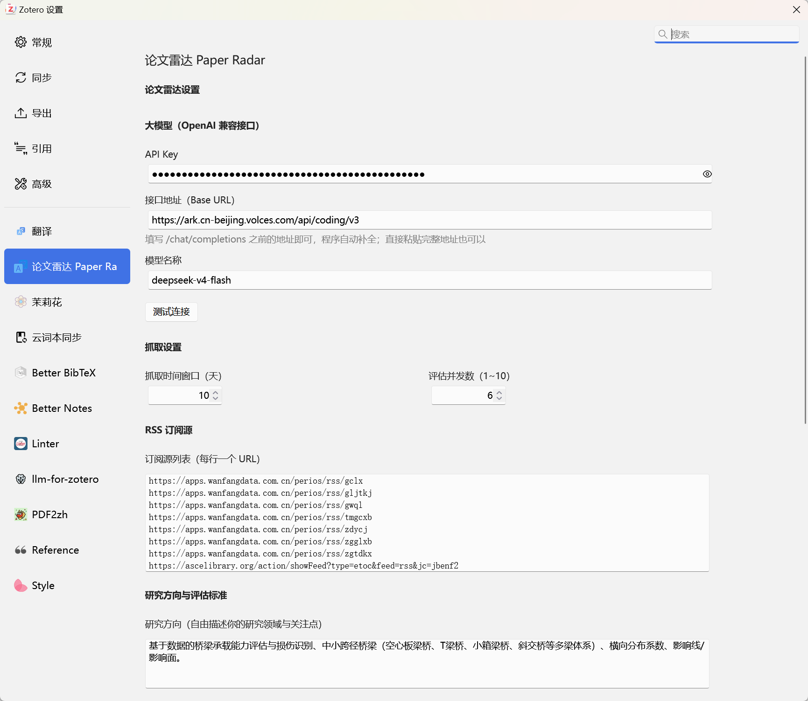
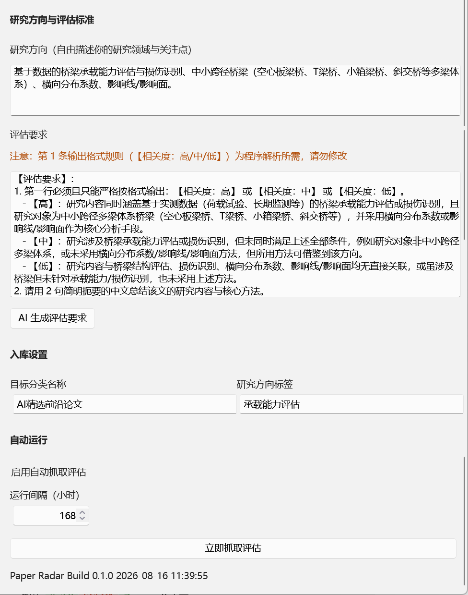

# Paper Radar（论文雷达）

> Zotero 插件：自动盯梢期刊更新，AI 帮你筛论文，高相关的直接进文献库。支持 Zotero 7 / 8 / 9。

<p align="center">
  
  
</p>

## 这是什么

Paper Radar 把「每周手动翻期刊找论文」变成一条全自动流水线：

1. **抓取**：并发监控两类来源——你订阅的**期刊 RSS**，以及按 **ISSN** 从 **Crossref** 扫描的期刊（含没有 RSS 的刊物，并能提前拿到在线抢先版文章）；
2. **评估**：逐篇调用大模型，按你的研究方向研判相关度（高/中/低），并生成 2 句中文解读；
3. **入库**：高、中相关论文自动存入 Zotero 专属分类，带完整元数据（DOI、作者、期刊、卷期、页码）、`相关度：高/中` 标签，以及一条**「AI 研判解读」子笔记**；
4. **去重**：低相关论文本地记录跳过，不占文献库；已处理的论文永不重复评估、重复入库。

```
RSS 订阅源 ───┐
              ├──▶ 时间窗口过滤 + DOI 去重 ──▶ 大模型评估 ──▶ 高/中相关入库
Crossref 扫描 ─┘                                          （标签 + AI 研判解读笔记）
（按 ISSN）                                                └─▶ Zotero 账号同步自动上传云端
```

**两类抓取来源怎么选**：

| 来源                  | 覆盖范围                                             | 适合                                                          |
| --------------------- | ---------------------------------------------------- | ------------------------------------------------------------- |
| **RSS 订阅源**        | 期刊官网 / 万方等数据库提供的订阅链接                | 中文期刊（万方最稳定）、以及提供 RSS 的英文刊                 |
| **Crossref 期刊扫描** | 收录几乎所有国际期刊（按 ISSN 查），不依赖有没有 RSS | 没有 RSS 的英文刊；想更早拿到在线抢先版（Ahead-of-Print）文章 |

> 两者可同时开启，结果会**按 DOI 自动合并去重**，同一篇文章只评估、入库一次。

**主要特性**：

- 🔌 任意 OpenAI 兼容接口：火山方舟 / DeepSeek / 硅基流动 / 本地 Ollama 均可
- 📡 双数据源：RSS 订阅 + Crossref 按 ISSN 扫描，互补覆盖中英文期刊
- ⏰ 自动运行：可设定抓取间隔（默认 7 天），后台按周期自动跑
- ✍️ 研究方向自由填写，评估提示词可一键「AI 生成」
- 🧪 内置自检：「测试连接」验证大模型、「测试所有期刊是否有效」验证 Crossref ISSN
- 🧹 跨来源 DOI 去重、时间窗口过滤，不重复评估、不重复入库

## 安装

1. 从 [Releases](https://github.com/xiaoxuan353/zotero-paper-radar/releases) 下载最新的 `paper-radar.xpi`；
2. Zotero 菜单 `工具 → 插件`，点右上角齿轮，选 **Install Plugin From File…**，选中下载的 xpi；
3. 按提示重启 Zotero 即可。

> 已装过旧版时，直接选择新的 xpi 安装即可替换（插件 ID 相同），装完**完全退出并重启 Zotero** 才会生效。

<details>
<summary>从源码构建（开发者）</summary>

```bash
git clone https://github.com/xiaoxuan353/zotero-paper-radar.git
cd zotero-paper-radar
npm install
npm run build
# 产物位于 .scaffold/build/paper-radar.xpi
# 开发调试：复制 .env.example 为 .env 并填入 Zotero 路径后 npm start（热重载）
```

</details>

## 使用

### 首次配置（约 2 分钟）

打开 Zotero 设置，左侧最下方找到 **「论文雷达 Paper Radar」** 面板（见上方截图）：

1. **大模型（OpenAI 兼容接口）**：填写 API Key、接口地址和模型名，点 **「测试连接」**，看到 ✅ 即通。接口地址填 `/chat/completions` 之前的 Base URL 即可，程序自动补全：

   | 平台                 | 接口地址（Base URL）                              | 模型示例            |
   | -------------------- | ------------------------------------------------- | ------------------- |
   | 火山方舟 Coding Plan | `https://ark.cn-beijing.volces.com/api/coding/v3` | `deepseek-v4-flash` |
   | 火山方舟 按量付费    | `https://ark.cn-beijing.volces.com/api/v3`        | 接入点 `ep-…`       |
   | DeepSeek 官方        | `https://api.deepseek.com/v1`                     | `deepseek-chat`     |
   | 本地 Ollama          | `http://localhost:11434/v1`                       | `qwen3:8b` 等       |

2. **研究方向**：自由描述你的研究领域与关注点（出厂默认为桥梁承载能力评估方向，换成你自己的）；
3. 点 **「AI 生成评估要求」**：调用你的大模型，自动生成与研究方向匹配的高/中/低分档判定标准（也可手工修改，但第 1 条输出格式规则为程序解析所需，勿动）；
4. **选择数据源**：至少配置一种。
   - **RSS 订阅源**（每行一个 URL）：默认内置 18 个，见 [什么是 RSS 订阅源？如何添加期刊？](#rss)
   - **Crossref 期刊扫描**（每行一个 `ISSN|刊名`）：默认内置 18 本国外刊，见 [什么是 Crossref 期刊扫描？如何添加期刊？](#crossref)
5. **抓取设置**：抓取时间窗口（默认 9 天）、评估并发数（1~10，默认 6）；
6. **入库设置**：目标分类名称（默认 `AI精选前沿论文`）、研究方向标签；
7. **自动运行**（可选）：勾选「启用自动抓取评估」并设定间隔小时数（默认 168 小时 = 7 天）。开启后无需手动操作，到点自动跑。

配置完成后，点设置面板底部的 **「立即抓取评估」**（或菜单 `工具 → 论文雷达 → 立即抓取评估`）即可跑一次。运行进度与结果会以弹窗提示：评估了多少篇、入库了多少篇（高/中）、Crossref 各刊是否扫描成功。

### 抓取是怎么工作的

- **时间窗口**：只处理最近 N 天（`抓取时间窗口`）发布的新文章。Crossref 扫描直接由服务端按日期过滤，窗口调大也不会漏抓。
- **去重**：按 DOI（无 DOI 时按标题）生成唯一 ID，跨来源去重；已处理（含判为低相关）的论文不会再评估。
- **入库判断**：只有高、中相关的论文才写入 Zotero；低相关仅本地记录。
- **失败自动重试**：大模型 429 限流、Crossref 网络抖动均有退避重试；单刊失败不影响其他刊。

## 数据源详解

<a id="rss"></a>

### 什么是 RSS 订阅源？如何添加期刊？

**什么是 RSS 订阅源？**

RSS（Really Simple Syndication）/ Atom 是期刊官网或数据库提供的「新文章自动通知」链接。只要期刊更新了最新论文，这个链接就会自动列出最新的条目。Paper Radar 的「RSS 订阅源」就是你告诉程序「盯哪些期刊」的清单——每个网址代表一个要持续监控的期刊。

**本插件默认内置这 18 个订阅源**（覆盖土木/桥梁方向，含中文刊与英文刊）：

| 期刊                                            | 订阅 URL                                                               |
| ----------------------------------------------- | ---------------------------------------------------------------------- |
| 工程力学（万方）                                | `https://apps.wanfangdata.com.cn/perios/rss/gclx`                      |
| 公路交通科技（万方）                            | `https://apps.wanfangdata.com.cn/perios/rss/gljtkj`                    |
| 国外桥梁（万方）                                | `https://apps.wanfangdata.com.cn/perios/rss/gwql`                      |
| 土木工程学报（万方）                            | `https://apps.wanfangdata.com.cn/perios/rss/tmgcxb`                    |
| 振动与冲击（万方）                              | `https://apps.wanfangdata.com.cn/perios/rss/zdycj`                     |
| 中国公路学报（万方）                            | `https://apps.wanfangdata.com.cn/perios/rss/zgglxb`                    |
| 中国铁道科学（万方）                            | `https://apps.wanfangdata.com.cn/perios/rss/zgtdkx`                    |
| 铁道学报（万方）                                | `https://apps.wanfangdata.com.cn/perios/rss/tdxb`                      |
| 振动工程学报（万方）                            | `https://apps.wanfangdata.com.cn/perios/rss/zdgcxb`                    |
| 建筑结构学报（万方）                            | `https://apps.wanfangdata.com.cn/perios/rss/jzjgxb`                    |
| 中国公路学报（官网）                            | `https://zgglxb.chd.edu.cn/CN/rss_zxly.xml`                            |
| J. Bridge Engineering（ASCE）                   | `https://ascelibrary.org/action/showFeed?type=etoc&feed=rss&jc=jbenf2` |
| J. Structural Engineering（ASCE）               | `https://ascelibrary.org/action/showFeed?type=etoc&feed=rss&jc=jsendh` |
| Engineering Structures（Elsevier）              | `https://rss.sciencedirect.com/publication/science/01410296`           |
| Structures（Elsevier）                          | `https://rss.sciencedirect.com/publication/science/23520124`           |
| Thin-Walled Structures（Elsevier）              | `https://rss.sciencedirect.com/publication/science/02638231`           |
| J. Sound and Vibration（Elsevier）              | `https://rss.sciencedirect.com/publication/science/0022460X`           |
| Structure and Infrastructure Engineering（T&F） | `https://www.tandfonline.com/feed/rss/nsie20`                          |

**如何添加你自己的期刊？**

1. 到目标期刊官网或数据库，找到 **RSS / Atom / Feed / 订阅** 图标或按钮，右键复制链接：

   | 来源                     | 怎么拿到 RSS 链接                                                                                                 |
   | ------------------------ | ----------------------------------------------------------------------------------------------------------------- |
   | 万方（中文刊首选）       | 期刊主页的 RSS 链接，把末尾的期刊代码换成目标刊即可，例如 `https://apps.wanfangdata.com.cn/perios/rss/<期刊代码>` |
   | Elsevier / ScienceDirect | 把期刊 ISSN 去掉连字符拼进去：`https://rss.sciencedirect.com/publication/science/<ISSN>`                          |
   | ASCE                     | 期刊页面找 RSS 图标复制链接，形如 `...&jc=<刊代码>`                                                               |
   | Taylor & Francis         | 期刊页面 RSS 图标，形如 `https://www.tandfonline.com/feed/rss/<刊代码>`                                           |

2. 把复制到的 `http(s)://` 开头地址粘贴到插件设置 → **RSS 订阅源** 输入框，**每行一个 URL**；
3. 保存即可，下次「立即抓取评估」就会监控新加入的期刊。

> 提示：中文期刊优先用万方 RSS（比官网更新更及时、格式更稳定）。若某刊**根本不提供 RSS**，请改用下方的 **Crossref 期刊扫描** 来覆盖——这正是我们做第二个数据源的原因。

<a id="crossref"></a>

### 什么是 Crossref 期刊扫描？如何添加期刊？

**什么是 Crossref？**

[Crossref](https://www.crossref.org) 是一个开放的学术论文元数据数据库，收录了几乎所有国际期刊的文献信息（标题、作者、DOI、期刊、出版日期等），**不依赖期刊是否提供 RSS**。Paper Radar 的「Crossref 期刊扫描」就是按期刊的 **ISSN** 去 Crossref 定时拉取该刊最新文章。

**它有什么用？**

- **兜底没有 RSS 的期刊**：有些期刊不公开 RSS（例如 _Structural Control and Health Monitoring_），但仍能被 Crossref 用 ISSN 扫到；
- **抢先版更早到手**：很多文章先在线出版（Ahead-of-Print / online-first）、稍后才进 RSS 或正式卷期——Crossref 能提前抓到这些文章；
- **元数据更全**：Crossref 直接给出作者、卷期、页码，入库条目更完整。

**如何添加期刊？**

1. 查到你目标期刊的 **ISSN**（8 位数字，如 `1545-2263`）——可从期刊官网、Google Scholar 或 [api.crossref.org](https://api.crossref.org) 查到。填的时候**不带连字符**（写成 `15452263` 或 `1545-2263` 都可以）；
2. 在插件设置 → **Crossref 期刊列表** 输入框**另起一行**填写：

   ```
   ISSN|期刊名称
   ```

   例如 `1545-2263|工程结构监测与健康维护`。竖线后的刊名**仅用于显示**，可填中文、可随意起名；

3. 保存即可，下次抓取时该刊就会被扫描。

**内置默认期刊**：插件已内置 18 本土木/桥梁方向的国外刊：

| ISSN      | 期刊                                          |
| --------- | --------------------------------------------- |
| 1545-2263 | Structural Control and Health Monitoring      |
| 1084-0702 | ASCE Journal of Bridge Engineering            |
| 0733-9445 | ASCE Journal of Structural Engineering        |
| 0141-0296 | Engineering Structures                        |
| 2352-0124 | Structures                                    |
| 0263-8231 | Thin-Walled Structures                        |
| 0022-460X | Journal of Sound and Vibration                |
| 1573-2479 | Structure and Infrastructure Engineering      |
| 0887-3828 | ASCE J. Performance of Constructed Facilities |
| 2190-5452 | J. Civil Structural Health Monitoring         |
| 1569-8025 | Structural Health Monitoring (SAGE)           |
| 0143-974X | J. Constructional Steel Research              |
| 1350-6307 | Engineering Failure Analysis                  |
| 0167-4730 | Structural Safety                             |
| 0098-8847 | Earthquake Engineering & Structural Dynamics  |
| 1570-761X | Bulletin of Earthquake Engineering            |
| 0045-7949 | Computers & Structures                        |
| 1369-4332 | Advances in Structural Engineering            |

**两个相关设置**：

- **启用 Crossref 按 ISSN 扫描**：不想用 Crossref 时取消勾选，只跑 RSS；
- **每刊返回条数上限**（默认 200）：这是安全上限，真正的「近 N 天」过滤由 Crossref 服务端按日期完成，所以**窗口调大也不会漏抓**。

**怎么验证填的 ISSN 对不对？**

设置面板里有一个 **「测试所有期刊是否有效」** 按钮。点一下会逐一检查你填写的每个 ISSN 在 Crossref 是否真实存在：

- ✅ 全部有效 → 绿色提示「N 个期刊均有效」；
- ❌ 有无效的 → 红字列出**具体哪几个刊**以及原因，例如 `Computers & Structures（No such journal in Crossref (404) — check the ISSN）`。

> 若提示 `HTTP 429` 之类的**限流**信息，说明只是请求太频繁（不是 ISSN 错），稍等片刻再点一次即可。

**注意**：Crossref 主要收录国际期刊，**中文期刊大多不在其中**（测试会显示 404），请继续用万方 RSS 覆盖中文刊。

## 常见问题

**Q：中文期刊能用 Crossref 扫吗？**
不能。Crossref 基本不收录中文期刊，测试时通常返回 404。中文刊请用万方 RSS（见 [RSS 订阅源](#rss)）。

**Q：RSS 和 Crossref 会重复入库吗？**
不会。两者结果按 DOI 合并去重，同一篇文章只评估、只入库一次。

**Q：自动运行没按我设的间隔跑 / 跑得太频繁？**
间隔基于「上一次运行时间 + 间隔小时数」判断。注意**只要跑过一次就算数**（哪怕没发现新论文），所以设 168 小时就是 7 天一次。若你刚改过间隔，需等下一个检查周期生效。

**Q：导入的文献被 Zotero 的 Linter 插件报 `require-creators`？**
本插件会写入作者信息（来自 RSS 与 Crossref）。若仍报错，请确认为 v0.2.0 及以上版本；**旧版导入的历史条目不会自动补作者**，需删除后重新抓取。

**Q：抓取时提示某些期刊「失败」怎么办？**
Crossref 扫描会显示成功/失败数。偶发失败多为网络抖动或限流，会自动重试；若某刊长期失败，用「测试所有期刊是否有效」确认 ISSN 是否正确。

## 开发

基于 [zotero-plugin-template](https://github.com/windingwind/zotero-plugin-template) 构建（TypeScript + esbuild + zotero-plugin-scaffold）。

```
src/modules/
  config.ts     读取偏好设置
  rss.ts        RSS/Atom 抓取与解析
  crossref.ts   Crossref 按 ISSN 扫描、元数据补全
  llm.ts        大模型评估与连接测试
  pipeline.ts   抓取 → 去重 → 评估 → 入库 主流程
  writer.ts     写入 Zotero 条目与笔记
  dedup.ts      已处理记录持久化
  scheduler.ts  自动运行调度
  prefsPane.ts  设置面板逻辑
```

## 许可

AGPL-3.0-or-later（继承自 zotero-plugin-template）
